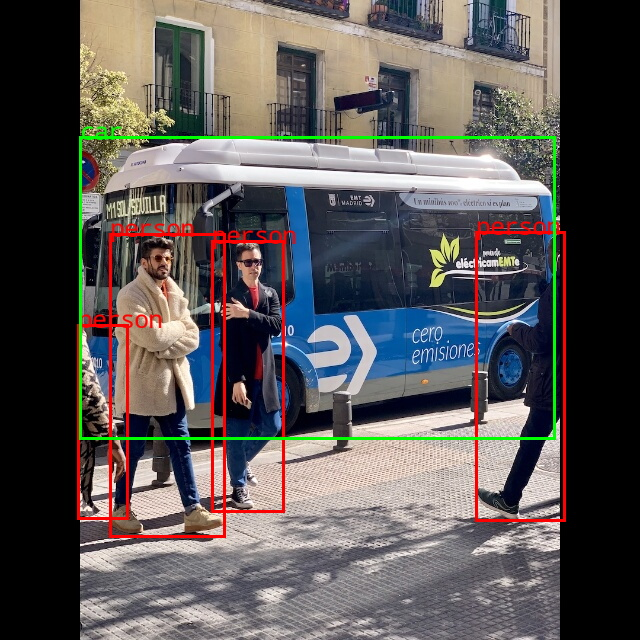

# LocateAnything-3B 导出 RKNN3 模型指南

[LocateAnything-3B](https://huggingface.co/nvidia/LocateAnything-3B) 是一个视觉定位多模态模型，支持目标检测、短语定位、文本定位、GUI 定位等任务。本示例将其拆分为 **Vision（MoonViT）** 和 **LLM（Qwen2.5** 两部分，导出为 RKNN3 可部署格式。

## 模型结构

| 模块 | 说明 |
|------|------|
| `vision_model` | MoonViT-SO-400M 视觉编码器 |
| `mlp1` | 视觉特征到 LLM hidden size 的投影层 |
| `language_model` | Qwen2.5-3B-Instruct 文本解码器（含 MTP block attention） |

导出时 Vision 与 LLM 分别生成 ONNX / RKNN；推理阶段由 C++ 侧完成图像 patch 预处理、视觉特征注入与自回归生成。

## 目录结构

```text
examples/LocateAnything/
├── README.md
├── cpp/                            # C++ 端到端部署 demo
│   ├── CMakeLists.txt
│   ├── main.cc                     # demo 入口（参数解析、可视化、性能统计）
│   ├── locate_anything.{h,cc}      # Vision + LLM 编排与共享内存
│   ├── llm/                        # LLM RKNN 封装
│   └── vision/                     # Vision RKNN 封装
├── data/                           # 量化数据集
│   └── llm/
│       ├── dataset.txt             # 量化数据集索引（由 export_llm.py 生成）
│       └── dataset_np/             # 量化数据集 .npy（由 export_llm.py 生成）
├── model/                          # 导出产物存放处
│   ├── llm/
│   └── vision/
├── res/                            # 测试图片与可视化结果
└── python/
    ├── model/                      # 导出用本地模型代码
    │   ├── modeling_locateanything.py
    │   ├── modeling_qwen2.py
    │   ├── modeling_vit.py
    │   └── ...
    ├── llm/
    │   ├── export_llm.py           # 导出 LLM ONNX / config / tokenizer / embed
    │   └── export_rknn.py          # LLM ONNX -> RKNN
    └── vision/
        ├── export_vision.py        # 导出 Vision ONNX
        ├── export_rknn.py          # Vision ONNX -> RKNN
        └── vision_config.json      # 视觉输入尺寸配置（export_vision.py 运行时生成）
```


补丁文件见：`python/export_llm_transformers.patch`

## 环境依赖

请先安装以下 Python 依赖：

```bash
pip install opencv-python-headless==4.11.0.86 transformers==4.57.1 numpy==1.25.0 Pillow==11.1.0 peft torchvision decord==0.6.0 lmdb==1.7.5
```
## 模型导出命令

以下命令分别在 `examples/LocateAnything/python/vision/` 与 `examples/LocateAnything/python/llm/` 目录下执行（脚本内部使用 `../../model/...` 相对路径，与运行目录绑定）。

### 1. Vision 模型

```bash
cd examples/LocateAnything/python/vision

# Step 1: 导出 ONNX
python export_vision.py \
    --model_path="nvidia/LocateAnything-3B" \
    --export_vision_path=../../model/vision/locateanything-3b-vision.onnx \
    --img_h=448 --img_w=448

export_vision.py导出完成后会在 `vision/` 目录生成 `vision_config.json`，记录 `img_h`、`img_w`、`patch_size`、`merge_kernel_size` 等参数，供 RKNN 转换时读取。

# Step 2: ONNX -> RKNN
python export_rknn.py \
    --onnx_path=../../model/vision/locateanything-3b-vision.onnx \
    --rknn_path=../../model/vision/locateanything-3b-vision.rknn \
    --dataset_path=../../../../datasets/MMBench/vision/datasets.txt \
    --platform=rk1828 \
    --core_num=8
```

### 2. LLM 模型

```bash
cd examples/LocateAnything/python/llm

# Step 1: 导出 ONNX / config / tokenizer / embed
python export_llm.py \
    --model_path="nvidia/LocateAnything-3B" \
    --export_llm_path=../../model/llm/locateanything-3b-llm.onnx

# Step 2: ONNX -> RKNN
#   --seq_len 动态输入上界（默认 128），--kvcache_len KV 缓存长度（默认 4096）
#   量化配置 w4a16/group32，kvcache Int4_to_F16/group16
python export_rknn.py \
    --onnx_path=../../model/llm/locateanything-3b-llm.onnx \
    --config=../../model/llm/locateanything-3b-llm.config.pkl \
    --rknn_path=../../model/llm/locateanything-3b-llm.rknn \
    --dataset_path=../../data/llm/dataset.txt \
    --platform=rk1828 \
    --seq_len=128 \
    --kvcache_len=4096 \
    --core_num=8
```

`export_llm.py` 参数：`--load_weight`(默认1) `--quan_dataset`(默认1, int) `--model_path` `--export_llm_path` `--dataset` `--dataset_out` `--dataset_np_dir` `--prompt_size`(默认64)
`llm/export_rknn.py` 参数：`--onnx_path` `--config` `--rknn_path` `--dataset_path` `--platform`(默认rk1828) `--seq_len`(默认128) `--kvcache_len`(默认4096) `--core_num`(默认8) `--no_quant`

> 注：如需跳过量化，在 `export_rknn.py` 加 `--no_quant`。

#### （可选）GRQ 量化导出

如需对 Vision 模型进行 GRQ（Group-wise Range Quantization）量化以减小模型体积、提升推理速度，可在导出 ONNX 时加入 `--quant` 参数。量化前需先用 `make_calidata.py` 生成校准数据。

```bash
# 1. 生成量化校准数据
python make_calidata.py \
    --model_path nvidia/LocateAnything-3B \
    --datapath ../../../../datasets/MMBench/llm/dataset.json \
    --export_datapath ./quant_data/model_inputs.json

# 2. 量化并导出 ONNX
python export_vision.py \
    --model_path nvidia/LocateAnything-3B \
    --export_vision_path ../../model/vision/locateanything-3b-vision_w8a16.onnx \
    --quant \
    --cali_dataset ./quant_data/model_inputs.json \
    --quantized_dtype w8a16 \
    --quantized_method group32 \
    --quantized_algorithm grq
```

| 参数 | 说明 |
|------|------|
| `--quant` | 启用 AWQ + GRQ 量化（需 CUDA 环境） |
| `--cali_dataset` | 校准数据路径（由 `make_calidata.py` 生成） |
| `--quantized_dtype` | 量化精度，可选 `w4a16` / `w8a16`（默认 `w8a16`） |
| `--quantized_method` | 量化分组方式，如 `group32`（默认 `group32`） |
| `--quantized_algorithm` | 量化算法，可选 `grq` / `normal`（默认 `grq`） |

`make_calidata.py` 参数：`--model_path`（模型路径） `--datapath`（输入数据集 JSON） `--export_datapath`（校准数据输出路径） `--n_samples`（最大采样数，默认 32）

> 注：GRQ 量化依赖 GPU（CUDA），若无 CUDA 环境会自动跳过量化并输出警告。量化后的 ONNX 后续同样使用 Step 2 的 `export_rknn.py` 转为 RKNN。

## 导出产物

### LLM

| 文件名 | 说明 |
|--------|------|
| `locateanything-3b-llm.onnx` | LLM ONNX 模型 |
| `locateanything-3b-llm.config.pkl` | RKNN LLM 配置（chat template、vocab 等） |
| `locateanything-3b-llm.tokenizer.gguf` | Tokenizer |
| `locateanything-3b-llm.embed.bin` | Embedding 权重 |
| `locateanything-3b-llm.rknn` | LLM RKNN 模型 |
| `locateanything-3b-llm.weight` | LLM 权重（build 后生成） |

### Vision

| 文件名 | 说明 |
|--------|------|
| `locateanything-3b-vision.onnx` | Vision ONNX 模型 |
| `locateanything-3b-vision.rknn` | Vision RKNN 模型 |
| `locateanything-3b-vision.weight` | Vision 权重（build 后生成） |
| `vision_config.json` | 视觉输入尺寸配置 |

## C Demo

### 构建

```bash
./build-linux.sh -t rk3588 -a aarch64 -d LocateAnything
```

构建产物在 `install/rk3588_linux_aarch64/rknn_locate_anything_demo/` 目录下，二进制名为 `rknn_locate_anything_demo`，所需模型文件会一并安装到其 `model/` 子目录，测试图片安装到 `res/` 子目录。

### 运行

```bash
./rknn_locate_anything_demo \
    model/locateanything-3b-vision.rknn model/locateanything-3b-vision.weight \
    model/locateanything-3b-llm.rknn model/locateanything-3b-llm.weight \
    model/locateanything-3b-llm.tokenizer.gguf model/locateanything-3b-llm.embed.bin \
    0xff 0xff \
    res/bus.jpg \
    "Locate all the instances that matches the following description: person</c>car." \
    448 448
```

参数说明：

```
rknn_locate_anything_demo <vision_model_path> <vision_weight_path> \
    <llm_model_path> <llm_weight_path> <tokenizer_path> <embedding_path> \
    <vision_core_mask> <llm_core_mask> <image_path> <prompt> [model_width model_height]
```

| 参数 | 说明 |
|------|------|
| `vision_model_path` | Vision RKNN 模型路径 |
| `vision_weight_path` | Vision 权重文件路径 |
| `llm_model_path` | LLM RKNN 模型路径 |
| `llm_weight_path` | LLM 权重文件路径 |
| `tokenizer_path` | Tokenizer 文件（`.tokenizer.gguf`） |
| `embedding_path` | Embedding 权重文件（`.embed.bin`） |
| `vision_core_mask` | Vision 模型使用的 NPU core 掩码（十六进制），需与导出时 `--core_num` 一致，如 8 核填 `0xff` |
| `llm_core_mask` | LLM 模型使用的 NPU core 掩码（十六进制），需与导出时 `--core_num` 一致，如 8 核填 `0xff` |
| `image_path` | 输入图片路径 |
| `prompt` | 文本提示，多类别用 `</c>` 分隔（见下方说明） |
| `model_width` | （可选）Vision 模型输入宽度，不传则从模型读取 |
| `model_height` | （可选）Vision 模型输入高度，不传则从模型读取 |

#### 多类别 Prompt 格式

类别之间用 `</c>` 作为分隔符，拼成一个字符串，整体格式为：

```
Locate all the instances that matches the following description: 类别1</c>类别2</c>类别3.
```

示例：

| 类别 | prompt 参数 |
|------|------------|
| 单类别 | `"Locate all the instances that matches the following description: person."` |
| 多类别 | `"Locate all the instances that matches the following description: person</c>car</c>bicycle."` |

模型输出用 `<ref>标签</ref>` 区分不同类别，每个类别后跟对应的 `<box>` 检测结果：

```
<ref>person</ref><box><43><475><137><865></box>...<ref>car</ref><box>None</box><ref>bicycle</ref><box>None</box>
```

- 找到目标：`<box><x1><y1><x2><y2></box>`
- 未找到目标：`<box>None</box>`

运行结束后，模型会输出带有 `<box>` 坐标的定位结果，并将检测结果可视化保存为 `locate_anything_vis.jpg`。示例输出：

```
<ref>person</ref><box><42><473><142><866></box><box><68><513><182><898></box>...
```

### 所需模型文件

| 文件名 | 说明 |
|--------|------|
| `locateanything-3b-vision.rknn` | Vision RKNN 模型 |
| `locateanything-3b-vision.weight` | Vision 权重文件 |
| `locateanything-3b-llm.rknn` | LLM RKNN 模型 |
| `locateanything-3b-llm.weight` | LLM 权重文件 |
| `locateanything-3b-llm.tokenizer.gguf` | Tokenizer 文件 |
| `locateanything-3b-llm.embed.bin` | Embedding 权重文件 |
| `res/bus.jpg` | 测试图片 |

### 运行结果

**输入图像**（`res/bus.jpg`）：


**可视化结果**（`locate_anything_vis.jpg`，框选检测到的 person / car 实例）：


