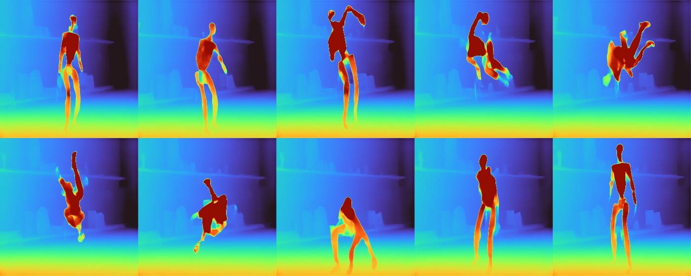

# Depth Anything V3 Base RKNN3

## 模型说明

模型来源：<https://huggingface.co/depth-anything/DA3-BASE>。

DA3-BASE 被拆分为三个 RKNN3 子模型：

1. `local` 对每张图片独立提取 token，按实际 view 数循环运行。
2. `global` 接收拼接后的多 view token，进行跨 view 特征建模。
3. `head` 接收 global 的四路 feature，输出每个 view 的 depth 和 confidence。

当前拆分模型输出 depth 和 confidence，不包含官方完整模型的 extrinsics 和 intrinsics 分支。

## 模型接口

当前已验证支持导出固定 `1-10 view` 的模型，使用 `V` 表示导出时指定的 view 数，更大的 view 数尚未验证。模型分辨率、view 数和 tensor shape 在 ONNX 导出后固定。下表以 `280x280` 分辨率为例。

| 子模型 | 输入 | 输出 |
|---|---|---|
| local | `images: [1,280,280,3]`, UINT8 NHWC | `local_tokens: [1,401,768]`, FP16 |
| global | `local_tokens: [V,401,1,768]`, FP32 BCAD | `feat_5/7/9/11: [V,400,1,1536]`, FP16 BCAD |
| head | `feat_5/7/9/11: [V,400,1536]`, FP16 | `depth/depth_conf: [1,V,280,280]`, FP16 |

## Python 环境

安装 ONNX 导出依赖：

```bash
uv pip install -r examples/depth_anything_v3/requirements.txt
```

## 导出 ONNX

以下以 10-view 为例，一次导出 Local、Global 和 Head：

```bash
python examples/depth_anything_v3/python/export_onnx.py \
  --model_path depth-anything/DA3-BASE \
  --output_dir examples/depth_anything_v3/model \
  --stage all \
  --views 10 \
  --image_size 280
```

| 参数 | 说明 |
|---|---|
| `--model_path` | Hugging Face 模型 ID 或本地模型目录 |
| `--output_dir` | ONNX 输出目录 |
| `--stage` | 导出阶段：`all`、`local`、`global` 或 `head` |
| `--views` | 固定 view 数，已验证范围为 1-10 |
| `--image_size` | 固定输入分辨率 |
| `--modelscope` | 从 ModelScope 下载 `--model_path` 指定的模型 |

输出文件为 `da3_base_local.onnx`、`da3_base_global.onnx` 和 `da3_base_head.onnx`。使用单阶段导出时只生成对应文件。

## 导出 RKNN

```bash
python examples/depth_anything_v3/python/export_rknn.py \
  --onnx_path examples/depth_anything_v3/model \
  --output_dir examples/depth_anything_v3/model
```

`--onnx_path` 支持 ONNX 文件或目录。目录模式根据文件名中的 `local`、`global`、`head` 关键字查找模型，并再次校验输入节点；缺失、重复或接口不匹配的模型会打印黄色 warning 并跳过。

| 参数 | 说明 |
|---|---|
| `--onnx_path` | 单个 ONNX 文件或包含三个子模型的目录 |
| `--output_dir` | RKNN、weight 和模型报告的输出目录；不指定时使用 ONNX 所在目录 |
| `--target_platform` | 目标平台，默认为 `rk1820` |
| `--core_num` | NPU 核数，范围为 1-8，默认为 8 |

默认转换配置如下：

- `target_platform=rk1820`
- `core_num=8`
- `quantized_dtype=w16a16`
- `do_quantization=False`
- `distribute_strategy=best_perf`
- `profile_mode=False`

每个模型会生成同名 `.rknn`、`.weight` 和 `<模型名>_model_report.html`。

## 编译

必须从 model-zoo 根目录通过统一入口编译，RGA 会由统一工程自动启用并打包：

```bash
export GCC_COMPILER=/path/to/aarch64-none-linux-gnu/bin/aarch64-none-linux-gnu
./build-linux.sh -t rk3588 -a aarch64 -d depth_anything_v3 -b Release
```

输出目录：

```text
install/rk3588_linux_aarch64/rknn_depth_anything_v3_demo/
```

目录中包含 `rknn_da3_base_demo`、`lib/librga.so` 和 RKNN3 runtime 库。统一脚本末尾可能提示 install 目录中没有 RKNN 模型；本示例的模型由 Python 脚本独立导出，该提示不影响编译结果。

## 板端运行

图片列表每行一个图片路径，行数不能少于 view 数。`model/` 目录已提供从 DA3 官方 `robot_unitree.mp4` 均匀抽取的 10 帧测试图片及 `images.txt`。三个 `.weight` 必须与对应 `.rknn` 位于同一目录且同名。

运行参数中的 `<views>` 必须与 ONNX 导出时的 `--views` 一致：

```bash
export LD_LIBRARY_PATH=$PWD/lib:$LD_LIBRARY_PATH
./rknn_da3_base_demo \
  local.rknn global.rknn head.rknn model/images.txt <views>
```

程序默认将每个 view 的深度热力图保存到当前执行目录下的 `depth_vis/`。如需修改输出目录，在命令末尾指定：

```bash
./rknn_da3_base_demo \
  local.rknn global.rknn head.rknn model/images.txt <views> custom_depth_vis
```

程序会为每个 view 生成一张 `depth_<序号>.jpg`，并合成为 `depth_vis/depth_montage.jpg`。热力图先将正深度转换为逆深度，再汇总所有 view 的有效像素，共享同一组 2% 至 98% 分位数裁剪范围并使用 Turbo 色表着色。远处为深蓝色，近处为红色，因此不同 view 中的相同颜色可用于比较相对深度；padding 和无效深度显示为黑色。

## 结果输出

以下为 10-view 输出结果示例：


