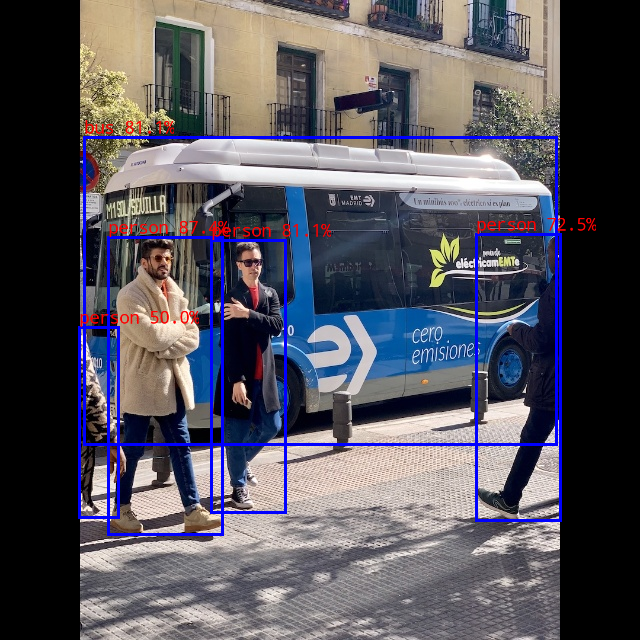

# YOLO26 RKNN 部署

## 1. 模型简介

- **模型用途**: 目标检测 (Object Detection)
- **模型来源**: Ultralytics YOLO26
- **模型规格**: yolo26n / yolo26s / yolo26m
- **任务类型**: COCO 80 类目标检测
- **部署内容**: ONNX 导出、RKNN 转换、Python COCO 精度测试、RKNN3 C++ 板端推理

### 参考精度

| 模型 | 输入尺寸 | PyTorch FP32 mAP@0.5:0.95 |
|------|----------|----------------------------|
| yolo26n | 640x640 | 40.9% |
| yolo26s | 640x640 | 48.6% |
| yolo26m | 640x640 | 53.1% |

### 模型文件

当前示例提供 `model/download_model.sh` 用于下载 PyTorch 权重文件：

```bash
cd examples/yolo26/model
chmod +x download_model.sh
./download_model.sh
```

执行后会在 `model/` 目录下得到：

- `model/yolo26n.pt`
- `model/yolo26s.pt`
- `model/yolo26m.pt`

ONNX、RKNN 和 weight 文件需要按后续章节导出和转换生成。当前工程目录中常用的板端测试文件为：

- `model/yolo26n.onnx`
- `model/yolo26n.rknn`
- `model/yolo26n.weight`

---

## 2. 模型结构

### 输入

- Shape: `[1, 3, 640, 640]`
- RKNN 输入格式: NHWC / UINT8
- 预处理: `mean_values=[[0, 0, 0]]`, `std_values=[[255, 255, 255]]`
- Resize: letterbox 到 640x640，默认 padding 值为 114

### 输出

当前 `convert.py` 直接从原始 ONNX 图截取 6 个检测 head 输出。分类 head 输出为 raw logits，不在 ONNX 图内追加 sigmoid，Python / C++ 后处理侧会根据输出名判断并执行 sigmoid。

| 索引 | 输出名 | Shape (640x640) | 说明 |
|------|--------|-----------------|------|
| 0 | `/model.23/one2one_cv2.0/one2one_cv2.0.2/Conv_output_0` | `[1, 4, 80, 80]` | box head - 尺度1 |
| 1 | `/model.23/one2one_cv3.0/one2one_cv3.0.2/Conv_output_0` | `[1, 80, 80, 80]` | score head - 尺度1，raw logits |
| 2 | `/model.23/one2one_cv2.1/one2one_cv2.1.2/Conv_output_0` | `[1, 4, 40, 40]` | box head - 尺度2 |
| 3 | `/model.23/one2one_cv3.1/one2one_cv3.1.2/Conv_output_0` | `[1, 80, 40, 40]` | score head - 尺度2，raw logits |
| 4 | `/model.23/one2one_cv2.2/one2one_cv2.2.2/Conv_output_0` | `[1, 4, 20, 20]` | box head - 尺度3 |
| 5 | `/model.23/one2one_cv3.2/one2one_cv3.2.2/Conv_output_0` | `[1, 80, 20, 20]` | score head - 尺度3，raw logits |

### 后处理

1. 对 3 个尺度的 box head 进行 box decode。
2. 对 score head 执行 sigmoid 后取最大类别分数。
3. 按类别执行 NMS。

Python 精度测试默认参数：

- `conf_thresh`: 0.001
- `nms_thresh`: 0.70
- `score_mode`: auto

C++ demo 默认参数：

- `BOX_THRESH`: 0.25
- `NMS_THRESH`: 0.45

---

## 3. 模型转换

进入 Python 目录：

```bash
cd /path/to/rknn3-model-zoo/examples/yolo26/python
```

导出 ONNX：

```bash
python ./export_onnx.py \
    --model_path ../model/yolo26n.pt \
    --output ../model/yolo26n.onnx \
    --img_size 640 \
    --simplify
```

转换 W8A8 RKNN：

```bash
python ./convert.py \
    --onnx ../model/yolo26n.onnx \
    --dtype w8a8 \
    --output ../model/yolo26n.rknn \
    --platform rk1820
```

当前转换配置：

- `quantized_dtype='w8a8'`
- `quantized_algorithm='normal'`
- `quantized_method='channel'`
- `optimization_level=3`
- `core_num=1`，仅 `rk1820` 平台设置
- `distribute_strategy='best_perf'`，仅 `rk1820` 平台设置
- `rk1820` W8A8 转换时对一个 score 分支子图设置 `w16a16`

---

## 4. Python COCO 精度测试

`infer.py` 支持 ONNX / RKNN 推理和 COCO bbox mAP 测试。

ONNX 测试：

```bash
cd /path/to/rknn3-model-zoo/examples/yolo26/python

python ./infer.py \
    --model-path ../model/yolo26n.onnx \
    --runtime sim \
    --img-folder /path/to/COCO/val2017 \
    --anno-json /path/to/COCO/annotations/instances_val2017.json \
    --output-json ./results_yolo26n_onnx_full.json \
    --coco-map-test
```

RKNN 连板测试：

```bash
cd /path/to/rknn3-model-zoo/examples/yolo26/python

python ./infer.py \
    --model-path ../model/yolo26n.rknn \
    --runtime board \
    --target rk1820 \
    --device-id <ip:port> \
    --img-folder /path/to/COCO/val2017 \
    --anno-json /path/to/COCO/annotations/instances_val2017.json \
    --output-json ./results_yolo26n_w8a8_rknn_full_board.json \
    --coco-map-test
```

当前工程实测结果：

| 模型 | 数据集 | mAP@0.5:0.95 | AP50 | AP75 | 说明 |
|------|--------|--------------|------|------|------|
| yolo26n ONNX FP32 | COCO val2017 | 39.79% | - | - | 参考结果 |
| yolo26n RKNN W8A8 | COCO val2017 5000 张 | 37.63% | 53.51% | 40.35% | 使用当前 `infer.py` 连板测试 |

---

## 5. C++ 板端推理

编译：

```bash
cd ~/rknn3-model-zoo
export GCC_COMPILER=/path/to/aarch64-linux-gnu

./build-linux.sh -t rk3588 -a aarch64 -d yolo26 -b Release
```

当前生成目录：

```text
install/rk3588_linux_aarch64/rknn_yolo26_demo
```

推送并运行。当前板端测试目录使用 `/data/rknn_yolo26_demo`：

```bash
adb -s <ip:port> push install/rk3588_linux_aarch64/rknn_yolo26_demo /data/
adb -s <ip:port> shell chmod +x /data/rknn_yolo26_demo/rknn_yolo26_demo

adb -s <ip:port> shell \
    "cd /data/rknn_yolo26_demo && \
     export LD_LIBRARY_PATH=./lib:\$LD_LIBRARY_PATH && \
     ./rknn_yolo26_demo model/yolo26n.rknn model/yolo26n.weight model/bus.jpg 0x1"
```

C++ demo 参数：

```text
./rknn_yolo26_demo <model_path> <weight_path> <image_path> <core_mask>
```

程序会在板端当前目录生成：

```text
out.png
```

### bus.jpg 最新实测输出

测试命令：

```bash
adb -s device-id shell \
  "cd /data/rknn_yolo26_demo && \
   export LD_LIBRARY_PATH=./lib:\$LD_LIBRARY_PATH && \
   ./rknn_yolo26_demo model/yolo26n.rknn model/yolo26n.weight model/bus.jpg 0x1"
```

```text
person @ (108 237 222 534) 0.874
bus @ (87 135 559 447) 0.811
person @ (211 240 285 512) 0.811
person @ (476 232 560 520) 0.725
person @ (79 327 118 517) 0.500
```



---

## 6. 文件结构

```text
yolo26/
├── README.md
├── cpp/
│   ├── CMakeLists.txt
│   ├── main.cc
│   ├── postprocess.cc
│   ├── postprocess.h
│   ├── yolo26.h
│   └── rknpu3/
│       └── yolo26.cc
├── python/
│   ├── requirements.txt
│   ├── export_onnx.py
│   ├── convert.py
│   └── infer.py
└── model/
    ├── bus.jpg
    ├── out.png
    ├── coco_80_labels_list.txt
    ├── download_model.sh
    └── images.txt
   
```
