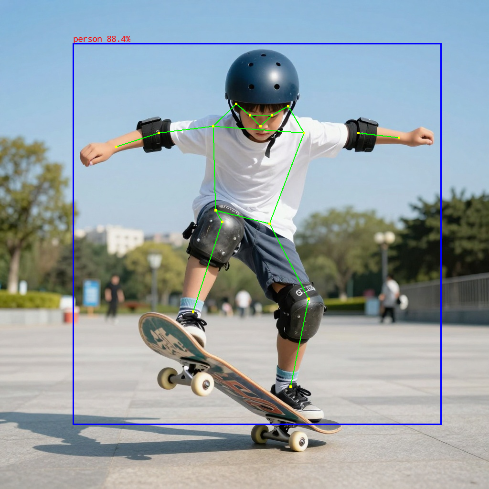

# YOLO26 Pose 示例说明

## ONNX 模型说明

本示例用于 YOLO26 Pose 人体姿态估计模型，支持目标框检测与 COCO 17 点人体关键点输出。

### 1. 模型文件

当前示例提供 `model/download_model.sh` 用于下载 PyTorch 权重文件：

```bash
cd examples/yolo26_pose/model
chmod +x download_model.sh
./download_model.sh
```

执行后会在 `model/` 目录下得到：

- `model/yolo26n-pose.pt`
- `model/yolo26s-pose.pt`
- `model/yolo26m-pose.pt`

ONNX、RKNN 和 weight 文件需要按后续章节导出和转换生成，例如：

### 2. 输出结构

`convert.py` 会从 YOLO26 Pose ONNX 中选择 3 个尺度的检测头输出，每个尺度包含：

- box head：边界框 DFL 回归输出
- score head：人体目标分数输出
- keypoint head：人体关键点输出，通道数为 `17 * 3`

转换后的默认输出为 9 个 tensor。当前 `yolo26n_pose.rknn` 在板端的实际输出为 INT8 / NCHW：

| 输出顺序 | 输出名 | Shape | 说明 |
|----------|--------|-------|------|
| output0 | box_1 | `[1, 4, 80, 80]` | stride 8 DFL 边界框回归 |
| output1 | score_1 | `[1, 1, 80, 80]` | stride 8 人体分数 |
| output2 | pos_1 | `[1, 51, 80, 80]` | stride 8 17 个关键点，每点 x/y/conf |
| output3 | box_2 | `[1, 4, 40, 40]` | stride 16 DFL 边界框回归 |
| output4 | score_2 | `[1, 1, 40, 40]` | stride 16 人体分数 |
| output5 | pos_2 | `[1, 51, 40, 40]` | stride 16 17 个关键点，每点 x/y/conf |
| output6 | box_3 | `[1, 4, 20, 20]` | stride 32 DFL 边界框回归 |
| output7 | score_3 | `[1, 1, 20, 20]` | stride 32 人体分数 |
| output8 | pos_3 | `[1, 51, 20, 20]` | stride 32 17 个关键点，每点 x/y/conf |

### 3. 后处理方式

当前示例默认使用主控端后处理：

- C++ 后处理实现在 `cpp/postprocess.cc`
- Python 后处理实现在 `python/infer.py`
- 支持 INT8、FP16、FP32 输出解析
- 支持 DFL 解码、score 解析、关键点解码、NMS、letterbox 坐标还原


## ONNX 模型导出

### 1. 安装 Python 依赖

```bash
cd examples/yolo26_pose/python
pip install -r requirements.txt
```

注意：

- `rknn3-toolkit` 不是 PyPI 包，需要手动安装 Rockchip 提供的 whl 包
- `export_onnx.py` 当前使用 `device='cuda'` 导出，导出环境需要可用 CUDA；如需 CPU 导出，请按实际环境调整脚本中的 `device` 参数

### 2. 导出 ONNX

以 `yolo26n-pose.pt` 为例：

```bash
cd examples/yolo26_pose/python
python3 export_onnx.py \
  --model_path ../model/yolo26n-pose.pt \
  --output ../model/yolo26n_pose.onnx \
  --img_size 640
```

导出脚本主要执行：

- Ultralytics YOLO ONNX 导出
- ONNX checker 校验
- onnxsim 简化

## 模型转换

### 1. RK1820 INT8 转换

```bash
cd examples/yolo26_pose/python
python3 convert.py \
  --onnx ../model/yolo26n_pose.onnx \
  --platform rk1820 \
  --dtype w8a8 \
  --output ../model/yolo26n_pose.rknn \
  --dataset ../model/images.txt \
  --core-num 1
```

注意：

- `--dataset` 默认使用 `../model/images.txt`，用于 INT8 量化校准
- `--core-num` 仅在 `--platform rk1820` 时生效，支持 `1` 或 `8`，默认 `1`
- RK1820 模型转换时的 `--core-num` 需要和板端运行时的 `core_mask` 匹配：
  - `--core-num 1`：运行时使用 `0x1`
  - `--core-num 8`：运行时使用 `0xff`
- INT8 转换时，`convert.py` 会对部分注意力和检测头子图配置 `subgraph_dtype_target=w16a16`，用于降低量化误差

### 2. 转换并执行板端推理测试

远程板端测试示例：

```bash
python3 convert.py \
  --onnx ../model/yolo26n_pose.onnx \
  --platform rk1820 \
  --dtype w8a8 \
  --output ../model/yolo26n_pose.rknn \
  --dataset ../model/images.txt \
  --device-id ip:port
```

RKNN3 平台精度分析示例：

```bash
python3 convert.py \
  --onnx ../model/yolo26n_pose.onnx \
  --platform rk1820 \
  --dtype w8a8 \
  --output ../model/yolo26n_pose.rknn \
  --dataset ../model/images.txt \
  --device-id ip:port \
  --accuracy-analysis
```

## C++ 示例编译和运行

### 1. 编译主程序

在项目根目录执行：

```bash
./build-linux.sh -t rk3588 -a aarch64 -d yolo26_pose -b Release
```

编译完成后，会在安装目录 `install/rk3588_linux_aarch64/rknn_yolo26_pose_demo/` 下生成运行包：

- `rknn_yolo26_pose_demo`：单张图片推理程序
- `rknn_yolo26_pose_dataset_eval`：COCO keypoints 数据集批量测试程序
- `model/`：测试图片、标签文件以及已转换的 RKNN/weight 文件
- `lib/`：运行依赖库

### 2. 单张图片推理

将安装目录推送到板端后执行。当前板端测试目录使用 `/data/rknn_yolo26_pose_demo`：

```bash
adb push install/rk3588_linux_aarch64/rknn_yolo26_pose_demo /data/
adb shell
cd /data/rknn_yolo26_pose_demo
export LD_LIBRARY_PATH=./lib:$LD_LIBRARY_PATH
```

通用命令格式：

```bash
./rknn_yolo26_pose_demo <model_path> <weight_path> <image_path> <core_mask> [postprocess_plugin_path]
```

参数说明：

- `model_path`：RKNN 模型路径
- `weight_path`：RKNN3 模型权重文件路径
- `image_path`：输入图片路径
- `core_mask`：NPU 核心掩码，十六进制格式
  - `0x1`：使用 NPU 核心 0
  - `0x2`：使用 NPU 核心 1
  - `0xff`：使用 8 核，需与 `--core-num 8` 转换出的 RK1820 模型匹配
- `postprocess_plugin_path`：可选，默认不需要传入

运行示例：

```bash
./rknn_yolo26_pose_demo model/yolo26n_pose.rknn model/yolo26n_pose.weight model/little_boy.jpg 0x1
```

程序会在当前目录生成：

- `out.png`：绘制检测框、类别、人体骨架和关键点后的图片
- `tensor_out/`：各输出 tensor 的二进制 dump 及 meta 信息

### little_boy.jpg 最新实测输出

测试命令：

```bash
adb -s device-id shell \
  "cd /data/rknn_yolo26_pose_demo && \
   export LD_LIBRARY_PATH=./lib:\$LD_LIBRARY_PATH && \
   ./rknn_yolo26_pose_demo model/yolo26n_pose.rknn model/yolo26n_pose.weight model/little_boy.jpg 0x1"
```

```text
person @ (153 91 923 888) 0.884
```



## Python 推理和评估

`python/infer.py` 支持 ONNX 和 RKNN 两种模型输入。

### 1. ONNX 推理

```bash
cd examples/yolo26_pose/python
python3 infer.py \
  --model-path ../model/yolo26n_pose.onnx \
  --img-folder ../../../datasets/COCO/subset \
  --output-json results_yolo26_onnx.json \
  --save-img-dir vis_onnx
```

### 2. RKNN 远程板端推理

```bash
cd examples/yolo26_pose/python
python3 infer.py \
  --model-path ../model/yolo26n_pose.rknn \
  --runtime board \
  --target rk1820 \
  --device-id ip:port \
  --core-mask 0x1 \
  --img-folder ../../../datasets/COCO/subset \
  --output-json results_yolo26_rknn_board.json \
  --save-img-dir vis_rknn_board
```

主要参数说明：

- `--model-path`：ONNX 或 RKNN 模型路径
- `--runtime`：RKNN 运行方式，`sim` 为本地模拟器，`board` 为远程板端
- `--target`：目标平台，例如 `rk1820`、`rk3572`
- `--device-id`：远程板端设备 ID
- `--core-mask`：运行核心掩码
- `--img-folder`：图片目录
- `--dataset-list`：图片路径列表，设置后优先使用该列表
- `--output-json`：COCO 格式结果文件
- `--save-img-dir`：可视化图片保存目录
- `--conf-thresh`：置信度阈值，默认 `0.001`
- `--nms-thresh`：NMS 阈值，默认 `0.70`
- `--coco-map-test`：推理结束后执行 COCO mAP 评估
- `--eval-type`：评估类型，支持 `bbox`、`keypoints`、`both`，默认 `keypoints`

## 数据集精度测试说明（可选）

测试数据集：COCO val2017

测试内容：

- bbox：目标框检测精度
- keypoints：人体关键点精度

### 1. 准备 COCO 数据集

```bash
cd datasets/COCO
python3 download_eval_dataset.py
```

执行后会得到：

- `val2017/`：COCO val2017 原始图片
- `annotations/`：COCO 标注文件，其中包含 `person_keypoints_val2017.json`
- `coco_dataset_path.txt`：板端图片路径列表，默认指向 `/userdata/val2017`

### 2. Python 数据集评估

```bash
cd examples/yolo26_pose/python
python3 infer.py \
  --model-path ../model/yolo26n_pose.onnx \
  --img-folder ../../../datasets/COCO/val2017 \
  --anno-json ../../../datasets/COCO/annotations/person_keypoints_val2017.json \
  --output-json results_yolo26_onnx_keypoints.json \
  --coco-map-test \
  --eval-type keypoints
```

同时评估 bbox 和 keypoints：

```bash
python3 infer.py \
  --model-path ../model/yolo26n_pose.onnx \
  --img-folder ../../../datasets/COCO/val2017 \
  --anno-json ../../../datasets/COCO/annotations/person_keypoints_val2017.json \
  --output-json results_yolo26_onnx_both.json \
  --coco-map-test \
  --eval-type both
```

### 3. C++ 板端数据集测试

#### 准备测试数据

```bash
adb push datasets/COCO/val2017 /userdata/
adb push datasets/COCO/coco_dataset_path.txt /userdata/coco_dataset_test_path.txt
```

#### 编译和部署

```bash
./build-linux.sh -t rk3588 -a aarch64 -d yolo26_pose -b Release
adb push install/rk3588_linux_aarch64/rknn_yolo26_pose_demo /data/
```

#### 运行批量推理

```bash
adb shell
cd /data/rknn_yolo26_pose_demo
export LD_LIBRARY_PATH=./lib:$LD_LIBRARY_PATH

./rknn_yolo26_pose_dataset_eval \
  model/yolo26n_pose.rknn \
  model/yolo26n_pose.weight \
  0x1 \
  --dataset-list /userdata/coco_dataset_test_path.txt \
  --output results_rknn_keypoints.json
```

推理结束后会在当前目录生成 `results_rknn_keypoints.json`。

可选参数：

- `--dataset-list path`：测试图片路径列表，默认 `/userdata/coco_dataset_test_path.txt`
- `--output json`：结果 JSON 文件，默认 `results_rknn_keypoints.json`
- `--conf-thresh value`：置信度阈值，默认 `0.001`
- `--nms-thresh value`：NMS 阈值，默认 `0.70`

#### 获取结果

```bash
adb pull /data/rknn_yolo26_pose_demo/results_rknn_keypoints.json ./
```

## 目录结构

```text
examples/yolo26_pose/
├── cpp/
│   ├── CMakeLists.txt
│   ├── main.cc
│   ├── dataset_eval.cc
│   ├── postprocess.cc
│   ├── postprocess.h
│   └── rknpu3/yolo26.cc
├── model/
│   ├── download_model.sh
│   ├── little_boy.jpg
│   ├── out.png
│   ├── coco_80_labels_list.txt
│   └── images.txt
└── python/
    ├── convert.py
    ├── export_onnx.py
    ├── infer.py
    └── requirements.txt
```

## 常见问题

### 1. 转换时找不到量化数据集

确认 `../model/images.txt` 中的图片路径可访问。当前列表指向 `../../../datasets/COCO/subset/` 下的校准图片。

### 2. 板端运行提示找不到动态库

进入安装目录后设置库路径：

```bash
export LD_LIBRARY_PATH=./lib:$LD_LIBRARY_PATH
```

### 3. RK1820 运行核心与转换核心数不匹配

如果转换时使用 `--core-num 1`，板端运行使用 `0x1`。如果转换时使用 `--core-num 8`，板端运行使用 `0xff`。

### 4. C++ 推理结果较多或较少

单张图片推理默认阈值在 `cpp/postprocess.h` 中配置：

```c
#define NMS_THRESH 0.45
#define BOX_THRESH 0.25
#define KEYPOINT_THRESH 0.25
```

数据集评估程序默认使用 `conf_thresh=0.001`、`nms_thresh=0.70`，可通过命令行参数调整。
